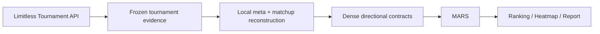

<div align="center">

# PTCGP Ranking · MARS


**Reproducible, uncertainty-aware Pokémon TCG Pocket deck ranking built from the Limitless Tournament API.**

[](https://github.com/indren9/ptcgp_ranking/releases/tag/v1.0.1)
[](https://www.python.org/)
[](LICENSE)
[](https://github.com/indren9/ptcgp_ranking/actions/workflows/tests.yml)
[](https://docs.limitlesstcg.com/developer)

[Quick start](#quick-start) · [Latest completed meta](#latest-completed-meta) · [Documentation Wiki](https://github.com/indren9/ptcgp_ranking/wiki) · [MARS](#mars-in-one-minute)

</div>

PTCGP Ranking turns atomic Pokémon TCG Pocket tournament evidence into local
metagame and matchup aggregates, then ranks decks with **MARS**
(Meta-Adjusted Regularized Score). It produces a ranking, heatmap, Excel report,
and reproducibility manifest while keeping uncertainty visible.

## Data source

For **Pokémon TCG Pocket**, the canonical/default source is the
[officially documented Limitless Tournament API](https://docs.limitlesstcg.com/developer).
The pipeline reads event-level tournament discovery, details, standings, and
pairings; selects the versioned release window; and aggregates the evidence
locally. Exact tournament IDs and immutable, hash-validated raw evidence support
replay. API failure never silently falls back to legacy HTML acquisition.

Legacy HTML acquisition remains available only for explicit rollback and
historical diagnostics. See [Limitless Tournament API Acquisition](https://github.com/indren9/ptcgp_ranking/wiki/Limitless-Tournament-API)
for the complete source boundary.

## Pipeline



Limitless supplies atomic tournament evidence. PTCGP Ranking performs release
selection, deck identity normalization, aggregation, uncertainty handling, and
MARS locally. Canonical technical identity is `deck_id`; `deck_name` is display
metadata.

<!-- latest-completed-meta:start -->

## See MARS in action

### Latest completed Pocket meta: B4 — Ruler of the Skies

`Pokémon TCG Pocket` `Standard` `41 decks` `24,483 decisive matches` `80.00–100.00% coverage`


| Rank | Deck | Score % | MAS % | LB % | BT % | Coverage % |
| ---: | --- | ---: | ---: | ---: | ---: | ---: |
| 1 | Hoopa ex Mega Absol ex | 97.00 | 54.42 | 52.45 | 78.13 | 100.00 |
| 2 | Mega Sceptile ex Greninja | 90.72 | 52.67 | 49.94 | 72.58 | 100.00 |
| 3 | Mega Altaria ex Espeon | 90.36 | 52.10 | 49.58 | 76.11 | 100.00 |
| 4 | Mega Lucario ex Lucario | 89.66 | 51.62 | 49.97 | 67.50 | 100.00 |
| 5 | Vespiquen ex Shuckle ex | 88.73 | 51.57 | 49.78 | 66.55 | 100.00 |
| 6 | Mega Altaria ex Greninja | 88.47 | 53.15 | 48.02 | 90.70 | 92.50 |
| 7 | Hoopa ex Mega Sableye ex | 85.06 | 53.19 | 49.23 | 61.38 | 100.00 |
| 8 | Magnezone ex Magnezone | 81.10 | 51.48 | 48.03 | 66.87 | 100.00 |
| 9 | Hoopa ex Greninja | 79.18 | 50.76 | 47.92 | 63.28 | 100.00 |
| 10 | Suicune ex Baxcalibur | 79.13 | 50.35 | 47.84 | 64.20 | 100.00 |

[Download the full ranking CSV](public/latest-meta/ranking.csv) · [Inspect the provenance manifest](public/latest-meta/manifest.json) · [Read the MARS methodology](MARS_explained.md)

`MAS_%` is posterior-smoothed performance against the observed meta; `LB_%` subtracts the configured uncertainty penalty. `BT_%` is regularized Bradley–Terry strength across the matchup graph. `Score_%` maps the standardized LB/BT composite through the normal CDF and is not a match win probability. `Coverage_%` is the share of core opponents with observed decisive matchup evidence.

> [!IMPORTANT]
> MARS is an analytical ranking of this observed, completed meta—not a tournament forecast. Sparse matchups, player skill, and later metagame shifts remain outside the score.

Built from public tournament data provided by [Limitless TCG](https://limitlesstcg.com/). See the official [Limitless developer guide](https://docs.limitlesstcg.com/developer). This independent project is not affiliated with or endorsed by Limitless TCG.

<!-- latest-completed-meta:end -->

## Quick start

```bash
git clone https://github.com/indren9/ptcgp_ranking.git
cd ptcgp_ranking
python -m venv .venv
python -m pip install -r requirements.txt
python -m cli.deck_ranking run --config config/pocket.yaml --progress
```

Activate the virtual environment before installing and running. The command
performs Tournament API acquisition, local reconstruction, MARS, and reporting.
Results are written below `outputs/`, scoped by game, format, and release.

The retained `--skip-scrape` name is a compatibility flag for a no-network
downstream rebuild from saved/frozen inputs. It is distinct from exact Tournament
API OFFLINE replay. See [Getting Started](https://github.com/indren9/ptcgp_ranking/wiki/Getting-Started).

## Reproducibility

```text
LIVE acquisition → frozen evidence → exact refs/hashes → deterministic OFFLINE replay
```

HTTP response caching is an optimization, not the source of truth. Frozen,
validated evidence is. Exact OFFLINE replay makes zero network calls and rebuilds
the normalized acquisition contracts deterministically.

For completed Pocket metas, GitHub Actions can now perform the complete rollover
after a successful expansion-catalog refresh: derive the newly completed set,
acquire canonical Tournament API evidence, persist immutable raw privately,
replay it OFFLINE, run Core + MARS, validate the public bundle, and publish only
after every gate passes. Any failure leaves the previously published snapshot
unchanged.

See [Reproducibility](https://github.com/indren9/ptcgp_ranking/wiki/Reproducibility).

## MARS in one minute

MARS combines a conservative lower-bound signal (`LB`) with regularized
Bradley–Terry strength (`BT`):

```text
z_comp = alpha × z(LB) + (1 - alpha) × z(BT)
Score_% = 100 × Phi(z_comp)
```

The shipped profiles use `Z_PENALTY: 1.96`. `Score_%` is a percentile-like
analytical composite, not a matchup win probability, and **MARS is not a
tournament forecast**. Read the [Wiki summary](https://github.com/indren9/ptcgp_ranking/wiki/MARS-Methodology)
or the canonical [MARS methodology](MARS_explained.md).

## Outputs

A normal run can produce a ranked CSV, observed win-rate heatmap, styled Excel
matchup report, machine-readable run manifest, and coverage diagnostics. The
`user`, `reproducible`, and `debug` profiles control persistence depth. See
[Outputs](https://github.com/indren9/ptcgp_ranking/wiki/Outputs) and the
[saved output contract](docs/output_contract.md).

## Game scope

| Game | Current acquisition architecture |
| --- | --- |
| Pokémon TCG Pocket | Limitless Tournament API is canonical/default |
| Physical Pokémon TCG | Supported through the existing Limitless page-based workflow; Tournament API acquisition has not yet been generalized |

The principal architecture above describes Pocket. Physical-TCG Tournament API
generalization remains post-v1 work.

## Documentation

The [GitHub Wiki](https://github.com/indren9/ptcgp_ranking/wiki) is the detailed
documentation layer: [Getting Started](https://github.com/indren9/ptcgp_ranking/wiki/Getting-Started),
[Limitless Tournament API](https://github.com/indren9/ptcgp_ranking/wiki/Limitless-Tournament-API),
[Architecture](https://github.com/indren9/ptcgp_ranking/wiki/Architecture),
[Reproducibility](https://github.com/indren9/ptcgp_ranking/wiki/Reproducibility),
[MARS Methodology](https://github.com/indren9/ptcgp_ranking/wiki/MARS-Methodology),
[Outputs](https://github.com/indren9/ptcgp_ranking/wiki/Outputs),
[Latest Completed Meta](https://github.com/indren9/ptcgp_ranking/wiki/Latest-Completed-Meta), and
[FAQ](https://github.com/indren9/ptcgp_ranking/wiki/FAQ).

## Attribution and license

Tournament evidence is provided by [Limitless TCG](https://limitlesstcg.com/)
through its [developer-documented API](https://docs.limitlesstcg.com/developer).
PTCGP Ranking performs the local aggregation, uncertainty handling, and MARS
analysis. This independent project is not affiliated with or endorsed by
Limitless TCG.

Released under the [MIT License](LICENSE). Pokémon and related names are
trademarks of their respective owners; see [NOTICE](NOTICE). The MIT License
covers this repository's code, and no license is asserted for third-party
tournament data.
