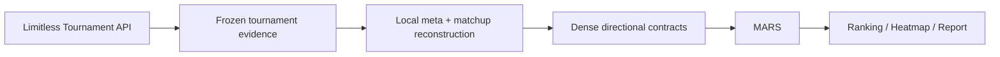

<div align="center">

# PTCGP Ranking · MARS


**Reproducible, uncertainty-aware Pokémon TCG Pocket deck ranking built from the Limitless Tournament API.**

[](https://github.com/indren9/ptcgp_ranking/releases/tag/v1.0.0)
[](https://www.python.org/)
[](LICENSE)
[](https://github.com/indren9/ptcgp_ranking/actions/workflows/tests.yml)
[](https://docs.limitlesstcg.com/developer)

[Quick start](#quick-start) · [Latest completed meta](#latest-completed-meta) · [Documentation Wiki](https://github.com/indren9/ptcgp_ranking/wiki) · [MARS](#mars-in-one-minute)

</div>

PTCGP Ranking turns atomic Pokémon TCG Pocket tournament evidence into local
metagame and matchup aggregates, then ranks decks with **MARS**
(Meta-Adjusted Regularized Score). It produces a ranking, heatmap, Excel report,
and reproducibility manifest while keeping uncertainty visible.

## Data source

For **Pokémon TCG Pocket**, the canonical/default source is the
[officially documented Limitless Tournament API](https://docs.limitlesstcg.com/developer).
The pipeline reads event-level tournament discovery, details, standings, and
pairings; selects the versioned release window; and aggregates the evidence
locally. Exact tournament IDs and immutable, hash-validated raw evidence support
replay. API failure never silently falls back to legacy HTML acquisition.

Legacy HTML acquisition remains available only for explicit rollback and
historical diagnostics. See [Limitless Tournament API Acquisition](https://github.com/indren9/ptcgp_ranking/wiki/Limitless-Tournament-API)
for the complete source boundary.

## Pipeline



Limitless supplies atomic tournament evidence. PTCGP Ranking performs release
selection, deck identity normalization, aggregation, uncertainty handling, and
MARS locally. Canonical technical identity is `deck_id`; `deck_name` is display
metadata.

<!-- latest-completed-meta:start -->

## Latest completed meta

### B3b — Everyday Wonders

`Pokémon TCG Pocket` · `Standard` · `39 decks` · `9,729 decisive matches` · `84.21–100.00% coverage`


| Rank | Deck | Score % | MAS % | LB % | BT % | Coverage % |
| ---: | --- | ---: | ---: | ---: | ---: | ---: |
| 1 | Suicune ex Baxcalibur | 94.00 | 53.88 | 51.59 | 73.54 | 100.00 |
| 2 | Miraidon ex Magnezone | 93.98 | 53.58 | 51.70 | 71.90 | 100.00 |
| 3 | Mega Blaziken ex Greninja | 92.91 | 53.93 | 51.07 | 74.22 | 100.00 |
| 4 | Indeedee ex Giratina ex | 91.23 | 54.25 | 50.85 | 68.55 | 97.37 |
| 5 | Mega Altaria ex Espeon | 90.67 | 53.79 | 49.98 | 77.68 | 100.00 |

[Full ranking CSV](public/latest-meta/ranking.csv) · [Heatmap](public/latest-meta/heatmap.png) · [Provenance manifest](public/latest-meta/manifest.json) · [Publication details](https://github.com/indren9/ptcgp_ranking/wiki/Latest-Completed-Meta)

This publication snapshot is the **Latest Completed Meta**; it is not the same
thing as the current Tournament API production/release window. B4 remains
production validation evidence and is not promoted here as completed meta.

<!-- latest-completed-meta:end -->

## Quick start

```bash
git clone https://github.com/indren9/ptcgp_ranking.git
cd ptcgp_ranking
python -m venv .venv
python -m pip install -r requirements.txt
python -m cli.deck_ranking run --config config/pocket.yaml --progress
```

Activate the virtual environment before installing and running. The command
performs Tournament API acquisition, local reconstruction, MARS, and reporting.
Results are written below `outputs/`, scoped by game, format, and release.

The retained `--skip-scrape` name is a compatibility flag for a no-network
downstream rebuild from saved/frozen inputs. It is distinct from exact Tournament
API OFFLINE replay. See [Getting Started](https://github.com/indren9/ptcgp_ranking/wiki/Getting-Started).

## Reproducibility

```text
LIVE acquisition → frozen evidence → exact refs/hashes → deterministic OFFLINE replay
```

HTTP response caching is an optimization, not the source of truth. Frozen,
validated evidence is. Exact OFFLINE replay makes zero network calls and rebuilds
the normalized acquisition contracts deterministically. See
[Reproducibility](https://github.com/indren9/ptcgp_ranking/wiki/Reproducibility).

## MARS in one minute

MARS combines a conservative lower-bound signal (`LB`) with regularized
Bradley–Terry strength (`BT`):

```text
z_comp = alpha × z(LB) + (1 - alpha) × z(BT)
Score_% = 100 × Phi(z_comp)
```

The shipped profiles use `Z_PENALTY: 1.96`. `Score_%` is a percentile-like
analytical composite, not a matchup win probability, and **MARS is not a
tournament forecast**. Read the [Wiki summary](https://github.com/indren9/ptcgp_ranking/wiki/MARS-Methodology)
or the canonical [MARS methodology](MARS_explained.md).

## Outputs

A normal run can produce a ranked CSV, observed win-rate heatmap, styled Excel
matchup report, machine-readable run manifest, and coverage diagnostics. The
`user`, `reproducible`, and `debug` profiles control persistence depth. See
[Outputs](https://github.com/indren9/ptcgp_ranking/wiki/Outputs) and the
[saved output contract](docs/output_contract.md).

## Game scope

| Game | Current acquisition architecture |
| --- | --- |
| Pokémon TCG Pocket | Limitless Tournament API is canonical/default |
| Physical Pokémon TCG | Supported through the existing Limitless page-based workflow; Tournament API acquisition has not yet been generalized |

The principal architecture above describes Pocket. Physical-TCG Tournament API
generalization remains post-v1 work.

## Documentation

The [GitHub Wiki](https://github.com/indren9/ptcgp_ranking/wiki) is the detailed
documentation layer: [Getting Started](https://github.com/indren9/ptcgp_ranking/wiki/Getting-Started),
[Limitless Tournament API](https://github.com/indren9/ptcgp_ranking/wiki/Limitless-Tournament-API),
[Architecture](https://github.com/indren9/ptcgp_ranking/wiki/Architecture),
[Reproducibility](https://github.com/indren9/ptcgp_ranking/wiki/Reproducibility),
[MARS Methodology](https://github.com/indren9/ptcgp_ranking/wiki/MARS-Methodology),
[Outputs](https://github.com/indren9/ptcgp_ranking/wiki/Outputs),
[Latest Completed Meta](https://github.com/indren9/ptcgp_ranking/wiki/Latest-Completed-Meta), and
[FAQ](https://github.com/indren9/ptcgp_ranking/wiki/FAQ).

## Attribution and license

Tournament evidence is provided by [Limitless TCG](https://limitlesstcg.com/)
through its [developer-documented API](https://docs.limitlesstcg.com/developer).
PTCGP Ranking performs the local aggregation, uncertainty handling, and MARS
analysis. This independent project is not affiliated with or endorsed by
Limitless TCG.

Released under the [MIT License](LICENSE). Pokémon and related names are
trademarks of their respective owners; see [NOTICE](NOTICE). The MIT License
covers this repository's code, and no license is asserted for third-party
tournament data.
