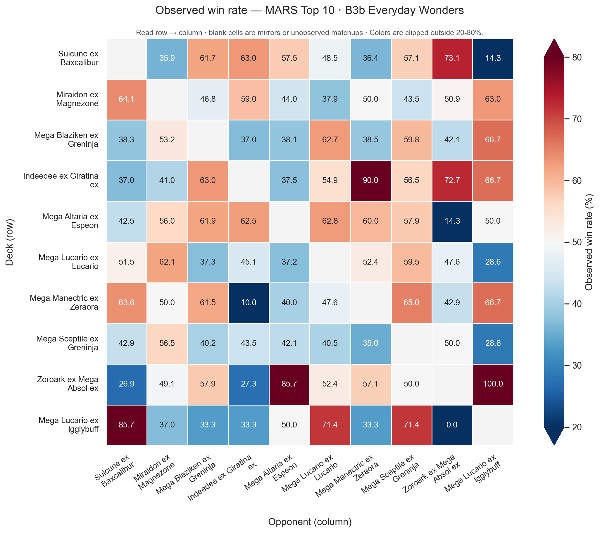
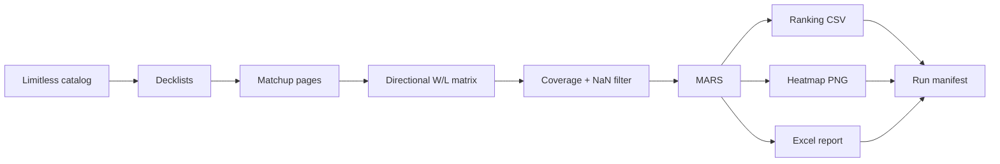
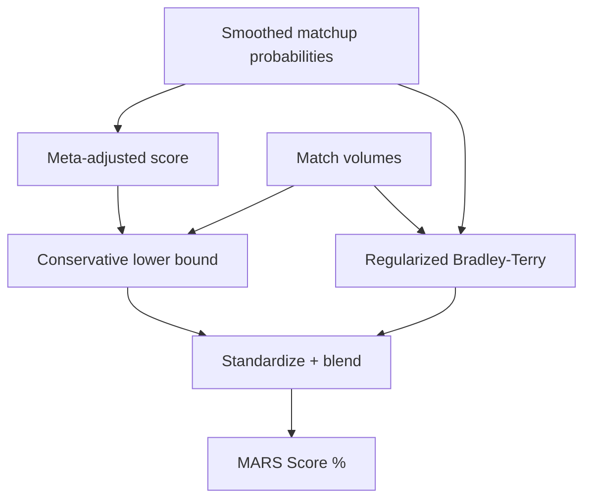

<div align="center">

# PTCGP Ranking · MARS


**From Limitless matchup data to a reproducible, uncertainty-aware deck ranking.**

[](https://www.python.org/)
[](LICENSE)
[](#game-profiles)
[](https://github.com/indren9/ptcgp_ranking/actions/workflows/tests.yml)
[](https://github.com/indren9/ptcgp_ranking/actions/workflows/update-expansion-catalog.yml)

[Quick start](#quick-start) · [Choose a workflow](#choose-a-workflow) · [See the outputs](#outputs) · [Understand MARS](#mars-in-one-minute) · [Use the Python API](#python-api)

</div>

PTCGP Ranking is an end-to-end analysis pipeline for **Pokemon TCG Pocket**
and **Pokemon TCG**. It discovers sets and formats, collects public tournament
data from [Limitless TCG](https://limitlesstcg.com/), builds directional
matchup matrices, controls sparse evidence, and produces a final ranking with
**MARS** (Meta-Adjusted Regularized Score).

The useful result is not just a number: every run can produce a ranked CSV, a
win-rate heatmap, a styled Excel matchup report, and a machine-readable run
manifest. One Python pipeline is the source of truth; the CLI and notebooks are
convenient interfaces around it.

> [!IMPORTANT]
> MARS is an analytical ranking, not a tournament forecast. Sparse matchups,
> metagame shifts, player skill, and the selected time window still matter.

## At a glance

| Capability | What you get |
| --- | --- |
| Two games | Separate profiles for Pocket and the physical Pokemon TCG |
| Automatic scope | Set and format resolution from the Limitless catalog |
| Responsible collection | Cache, retry, delay, jitter, and scrape timing diagnostics |
| Evidence controls | Candidate-pool selection, NaN filtering, coverage, and volume checks |
| Robust ranking | Bayesian smoothing, MAS/SE/LB, Bradley-Terry strength, and meta weighting |
| Exploration | Optional wildcard review for low-play decks outside the ranking core |
| Friendly deliverables | CSV ranking, PNG heatmap, styled XLSX report, and JSON manifest |
| Three interfaces | CLI for automation, Python API for integration, notebook for exploration |

<!-- latest-completed-meta:start -->

## See MARS in action

### Latest completed Pocket meta: B3b — Everyday Wonders

`Pokémon TCG Pocket` `Standard` `39 decks` `9,729 decisive matches` `84.21–100.00% coverage`



| Rank | Deck | Score % | MAS % | LB % | BT % | Coverage % |
| ---: | --- | ---: | ---: | ---: | ---: | ---: |
| 1 | Suicune ex Baxcalibur | 94.00 | 53.88 | 51.59 | 73.54 | 100.00 |
| 2 | Miraidon ex Magnezone | 93.98 | 53.58 | 51.70 | 71.90 | 100.00 |
| 3 | Mega Blaziken ex Greninja | 92.91 | 53.93 | 51.07 | 74.22 | 100.00 |
| 4 | Indeedee ex Giratina ex | 91.23 | 54.25 | 50.85 | 68.55 | 97.37 |
| 5 | Mega Altaria ex Espeon | 90.67 | 53.79 | 49.98 | 77.68 | 100.00 |
| 6 | Mega Lucario ex Lucario | 88.77 | 52.21 | 49.69 | 73.72 | 100.00 |
| 7 | Mega Manectric ex Zeraora | 87.18 | 52.97 | 48.39 | 85.30 | 97.37 |
| 8 | Mega Sceptile ex Greninja | 84.63 | 51.54 | 49.28 | 64.60 | 100.00 |
| 9 | Zoroark ex Mega Absol ex | 83.03 | 52.72 | 48.31 | 72.83 | 97.37 |
| 10 | Mega Lucario ex Igglybuff | 76.80 | 53.51 | 47.50 | 66.99 | 86.84 |

[Download the full ranking CSV](public/latest-meta/ranking.csv) · [Inspect the provenance manifest](public/latest-meta/manifest.json) · [Read the MARS methodology](MARS_explained.md)

`MAS_%` is posterior-smoothed performance against the observed meta; `LB_%` subtracts the configured uncertainty penalty. `BT_%` is regularized Bradley–Terry strength across the matchup graph. `Score_%` maps the standardized LB/BT composite through the normal CDF and is not a match win probability. `Coverage_%` is the share of core opponents with observed decisive matchup evidence.

> [!IMPORTANT]
> MARS is an analytical ranking of this observed, completed meta—not a tournament forecast. Sparse matchups, player skill, and later metagame shifts remain outside the score.

Built from public tournament data provided by [Limitless TCG](https://limitlesstcg.com/). See the official [Limitless developer guide](https://docs.limitlesstcg.com/developer). This independent project is not affiliated with or endorsed by Limitless TCG.

<!-- latest-completed-meta:end -->

## How the pipeline flows



<details>
<summary><strong>Why this is more than a raw win-rate table</strong></summary>

Raw win rate can reward decks with few matches or an unusually favorable
opponent mix. MARS smooths uncertain matchups, adjusts for the observed meta,
penalizes uncertainty, and blends that conservative signal with a regularized
Bradley-Terry estimate over the matchup graph. The full derivation and design
notes live in [MARS_explained.md](MARS_explained.md).

</details>

## Quick start

### 1. Install

```bash
git clone https://github.com/indren9/ptcgp_ranking.git
cd ptcgp_ranking

python -m venv .venv
```

Activate the environment:

```powershell
# Windows PowerShell
. .venv/Scripts/Activate.ps1
```

```bash
# macOS / Linux
source .venv/bin/activate
```

Then install the pinned dependencies:

```bash
python -m pip install -r requirements.txt
```

### 2. Run Pocket

```bash
python -m cli.deck_ranking run --config config/pocket.yaml --progress
```

By default, outputs are written below `outputs/` and automatically scoped by
game, format, and set. The scraper deliberately uses a polite delay; the first
uncached run can take time.

### 3. Open the results

```text
outputs/<GAME>/<FORMAT>/<CODE>__<NAME>/
├── rankings/mars/mars_ranking_latest.csv
├── matrices/heatmaps/wr_heatmap_latest.png
├── reports/mars/mars_matchup_report_latest.xlsx
└── run/run_manifest_latest.json
```

## Choose a workflow

| I want to… | Recommended command or interface |
| --- | --- |
| Rank the current Pocket format | `python -m cli.deck_ranking run --config config/pocket.yaml --progress` |
| Rank the physical TCG | `python -m cli.deck_ranking run --config config/tcg.yaml --progress` |
| Explore low-play candidates | Use `config/pocket_wildcard.yaml` or `config/tcg_wildcard.yaml` |
| Preview every discovered set | `python -m scripts.run_all_sets --config config/pocket.yaml --dry-run` |
| Run a few specific sets | `python -m scripts.run_all_sets --only A1,A1a --continue-on-error` |
| Run every catalog format | `python -m scripts.run_all_sets --formats all --continue-on-error --progress` |
| Inspect each intermediate table | Open `notebooks/deck_ranking_run_all.ipynb` |
| Embed the pipeline in code | Call `run_deck_ranking(...)` from the [Python API](#python-api) |
| Rebuild without scraping | Use the `reproducible` output profile, then rerun with `--skip-scrape` |

<details>
<summary><strong>More CLI recipes</strong></summary>

Run one configured profile and place results somewhere else:

```bash
python -m cli.deck_ranking run \
  --config config/pocket.yaml \
  --output-dir D:/ptcgp-results \
  --progress
```

Inspect the first five discovered sets without running them:

```bash
python -m scripts.run_all_sets \
  --config config/pocket.yaml \
  --limit 5 \
  --dry-run
```

Process all sets from oldest to newest and continue after recoverable failures:

```bash
python -m scripts.run_all_sets \
  --config config/pocket.yaml \
  --oldest-first \
  --continue-on-error \
  --progress
```

Rebuild analysis and reports from previously saved reproducible inputs:

```bash
python -m cli.deck_ranking run \
  --config config/pocket.yaml \
  --skip-scrape \
  --progress
```

Available stage switches are `--skip-scrape`, `--skip-core`, `--skip-mars`,
`--skip-heatmap`, and `--skip-report`. Run any entry point with `--help` for the
complete argument list.

</details>

## Game profiles

Four ready-to-run configurations are included:

| Profile | Game | Candidate scope | Best for |
| --- | --- | --- | --- |
| [`pocket.yaml`](config/pocket.yaml) | Pokemon TCG Pocket | Core meta | Normal ranking |
| [`pocket_wildcard.yaml`](config/pocket_wildcard.yaml) | Pokemon TCG Pocket | Full decklist | Low-play deck exploration |
| [`tcg.yaml`](config/tcg.yaml) | Pokemon TCG | Core meta | Normal ranking |
| [`tcg_wildcard.yaml`](config/tcg_wildcard.yaml) | Pokemon TCG | Full decklist | Low-play deck exploration |

The normal candidate pool follows cumulative metagame share and then applies
the configured evidence filter. Wildcard profiles preserve the comparable MARS
core while evaluating excluded decks separately; they do **not** silently
promote a wildcard into the main ranking.

The repository also publishes a compact, automatically refreshed
[Pocket expansion catalog](public/expansions_pocket_standard.csv).

## Outputs

Every result is routed under a collision-safe scope:

```text
outputs/<GAME>/<FORMAT>/<CODE>__<NAME>/
├── decklists/
│   ├── raw/
│   └── top_meta/
├── matchups/
│   ├── raw/
│   └── scores/
├── matrices/
│   ├── heatmaps/
│   ├── match_counts/
│   └── winrate/
├── diagnostics/
│   ├── nan_filter/
│   └── wildcards/
├── rankings/mars/
├── reports/mars/
└── run/
```

### Saving profiles

The `saving.output_profile` setting controls how much is persisted:

| Profile | Keeps | Use it when… |
| --- | --- | --- |
| `user` | Ranking, heatmap, Excel report, relevant wildcard table, manifest | You want compact final deliverables |
| `reproducible` | Everything in `user`, plus raw decklist/top-meta/matchups | You need to rebuild without scraping |
| `debug` | Rich intermediate matrices, diagnostics, and timestamped artifacts | You are developing or investigating |

The in-memory `result.frames` stays rich even when the compact `user` profile
is selected. The exact persistence contract is documented in
[`docs/output_contract.md`](docs/output_contract.md).

<details>
<summary><strong>What is inside the Excel report?</strong></summary>

The workbook is designed as the human-readable deliverable. It includes a
summary, the ranking context, matchup views, per-deck sheets, and a legend. The
writer uses atomic replacement and retry handling so an already open workbook
fails cleanly instead of leaving a partial file.

</details>

## Python API

```python
from pipelines.deck_ranking import run_deck_ranking

result = run_deck_ranking(
    config_path="config/pocket.yaml",
    output_dir="outputs",
    run_scrape=True,
    run_mars=True,
    run_heatmap=True,
    run_report=True,
    show_progress=True,
)

ranking = result.frames["mars_ranking"]
print(ranking.head(10))

print(result.outputs["report_latest"])
print(result.outputs["run_manifest"])
```

The result object exposes:

- `frames`: DataFrames produced during the run;
- `outputs`: paths of artifacts actually written for the selected profile;
- `diagnostics`: resolved scope, coverage, filtering, timing, and MARS details;
- `expansion`, `decks_url`, and `catalog`: source-resolution context.

## Notebook workflow

Open [`notebooks/deck_ranking_run_all.ipynb`](notebooks/deck_ranking_run_all.ipynb),
select the project virtual environment as the kernel, and choose a profile in
the first configuration cell:

```python
GAME_PROFILE = "pocket"           # Pocket, normal ranking
GAME_PROFILE = "pocket_wildcard"  # Pocket, wildcard appendix
GAME_PROFILE = "tcg"              # Physical TCG, normal ranking
GAME_PROFILE = "tcg_wildcard"     # Physical TCG, wildcard appendix
```

Run all cells to preview the resolved source, analysis scope, scrape timing,
NaN diagnostics, ranking, heatmap, saved outputs, and wildcard review.

`deck_ranking_run_all_dev.ipynb` is intentionally reserved for local
development. It can enable fast scraping through a conspicuous environment
flag and should not be used as the normal collection workflow.

## MARS in one minute

MARS combines two complementary signals:

1. **LB** — a conservative meta-adjusted score built from smoothed matchup win
   probabilities: `LB = MAS - z × SE`.
2. **BT%** — a regularized Bradley-Terry strength estimate over the connected
   matchup graph.

Both are standardized before blending:

```text
z_comp = alpha × z(LB) + (1 - alpha) × z(BT)
Score_% = 100 × Phi(z_comp)
```

This is the mapping implemented in `mars/composite.py`. `Score_%` is a
percentile-like composite score, not a matchup win probability.



For assumptions, automatic regularization, missing-matchup policy, and the full
mathematical notes, read [MARS_explained.md](MARS_explained.md).

## Wildcard diagnostics

Wildcard mode looks beyond the normal candidate pool without contaminating the
main ranking. Each excluded deck is summarized against the core through:

- `evidence_tier`: matchup coverage and match volume;
- `performance_tier`: weighted win rate against the core;
- `promotion_tier`: readable labels such as `high_confidence_candidate`,
  `watchlist`, and `not_recommended`.

> [!WARNING]
> A full wildcard scrape can involve many more deck pages. With the default
> polite delay, a cold run may take considerably longer than a normal run.

## Configuration

The YAML profiles are meant to be copied and adjusted. A minimal set of useful
knobs looks like this:

```yaml
source:
  provider: limitless
  game: POCKET
  format:
    mode: auto      # auto | code
    code: ""

scraping:
  request_delay_sec: 5.0
  request_delay_jitter_frac: 0.25

paths:
  output_dir: outputs

saving:
  output_profile: user  # user | reproducible | debug

top_meta:
  threshold_pct: 80.0
  ensure_at_least: 1

analysis:
  candidate_pool:
    share_pct: 80.0

nan_filter:
  mode: fixed
  max_nan_ratio: 0.15
  min_nan_allowed: 1
```

`paths.output_dir` may be relative to the repository or absolute. For temporary
overrides, prefer `--output-dir` so the tracked profiles remain portable.

<details>
<summary><strong>Cache and collection behavior</strong></summary>

- Expansion catalogs and page responses are cached with configurable TTLs.
- Retries use backoff; uncached requests use delay plus jitter.
- Duplicate matchup URLs are fetched once and diagnosed.
- Cache hits do not incur artificial network delay.
- Timing diagnostics record page counts, cache hits/misses, and elapsed time.

Please keep responsible request settings when adapting the project.

</details>

## Project map

```text
cli/          command-line entry point
config/       ready-to-run YAML profiles and aliases
core/         normalization, matrices, consolidation, NaN diagnostics
domain/       expansion model
mars/         ranking model and diagnostics
notebooks/    user and development notebook interfaces
pipelines/    end-to-end orchestration
reporting/    tables, plots, logs, and Excel generation
scripts/      batch runners and catalog export
sources/      Limitless adapters
storage/      output paths, routing, and writers
tests/        unit and integration-style contract tests
```

Compatibility wrappers remain under `scraper/` and `utils/` for older imports.

## Development

Run the complete test suite:

```bash
pytest -q
```

Regenerate the tracked project tree:

```bash
python utils/make_project_tree.py
```

Contributions are welcome. Please read [CONTRIBUTING.md](CONTRIBUTING.md) for
the workflow, expectations, and legal notes.

## Documentation

- [MARS method](MARS_explained.md)
- [Saved output contract](docs/output_contract.md)
- [Latest completed meta automation](docs/latest_completed_meta.md)
- [Google Sheets expansion export](docs/google_sheets_expansions.md)
- [Contributing guide](CONTRIBUTING.md)
- [Citation metadata](CITATION.cff)

## License, citation, and disclaimer

Released under the [MIT License](LICENSE). If this project supports your work,
please use the citation metadata in [`CITATION.cff`](CITATION.cff):

```text
Visentin, A. (2025). PTCGP Ranking — MARS.
https://github.com/indren9/ptcgp_ranking
```

Pokemon and related names are trademarks of their respective owners. This
independent project is not affiliated with, endorsed by, or sponsored by The
Pokemon Company, Nintendo, Game Freak, Creatures, or Limitless TCG. See
[NOTICE](NOTICE). The MIT License covers this repository's code; no license is
asserted for third-party tournament data.

<div align="center">

Built by [Andrea Visentin](https://github.com/indren9) for curious players who
want rankings with the uncertainty left in.

</div>
